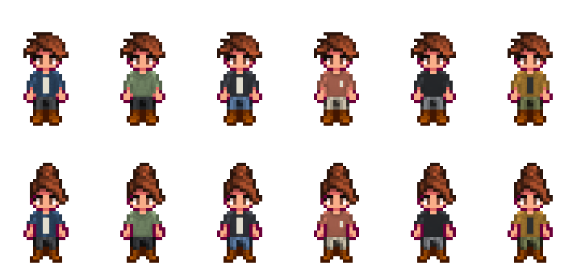

# Modern wardrobe — first collection

Six modern looks add twelve independently wearable items: six shirts and six pants. The collection includes denim layers, a sage hoodie, charcoal city layers, a coral pocket tee, a black crewneck and an ochre utility overshirt with coordinating trousers.

For a new farmer, use the normal shirt and pants arrows in character creation. For an existing farmer, Sandy stocks every piece for 1,000g once the desert is accessible. Pieces can be mixed and dyed through the game's existing clothing systems. Existing outfits are retained.

The production sprites use the game's body and animation proportions. Fine seams from the enlarged concept are simplified; pants retain the native straight-leg silhouette and shoes are equipped separately.

The catalog uses permanent string IDs, separate logical/HD textures and authored fashion metadata. Further collections can be added without replacing this collection or changing a saved outfit. NPC reactions belong to the separate Solace social feature.

## Verification

Installed 0.18 package: 640 files, 607 registered replacement textures and 17 HD companions. The native HD/creator audit passed 103 checks. All twelve items passed 73 native item/creator/shop/dye/source-frame checks. A mixed denim shirt and utility trousers, dyed independently, survived native overnight saving and loading with exact IDs and colors.

Final GPU verification passed 315 checks across 252 native character renders, with 744 custom-clothing draws and no out-of-bounds source rectangles. Both bodies, four facings, four dye choices, native sitting/swimming drawing and selected static walk/arm frames were visually reviewed. The normal SMAPI launch verified all 640 installed files. All 630 previous PNGs and all eleven real save files remained unchanged. Human playtesting should include a few tool swings, walking and normal outfit changes; static pose samples do not prove every action or multiplayer configuration.

Evidence: artifacts/new-game-persistence/phone-clothing-20260906; artifacts/npc-modern/evidence/installed-0.18.0.json; artifacts/player-modern/clothing-options/prior-art-preserved.json.
