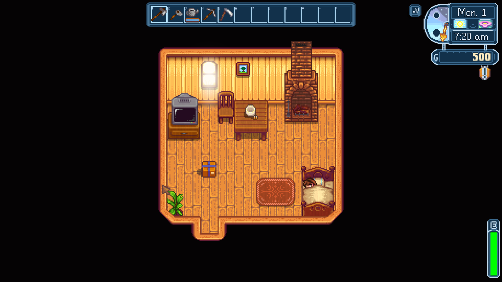
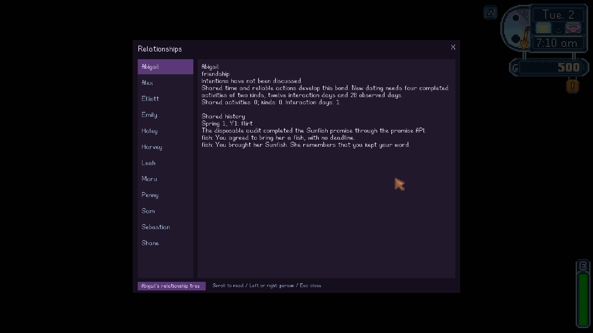

# New games and Living Memory — verified September 6, 2026

The installed artwork and Living Memory work in a newly created single-player farm. Conversations stay with that farm: they survive a successful save and restart, and do not appear in a separate new game. No production initialization fix was needed.

## What was actually tested

Two disposable farms were created through the native new-character completion flow, with distinct game IDs. Native and SMAPI save paths were redirected to an isolated profile before creation; neither farm reused a player save.

- First farm: actual SaveCreated, SaveLoaded and DayStarted events; memory and relationships ready on the first day, with empty conversation/personal history.
- All 547 artwork registrations passed pixel checks in the new world, again after a full process restart, and in the second new farm. The live farmhouse capture shows the installed interior and blue UI.
- A controlled exchange and sourced personal preference were recorded through the production memory methods. Promise completion, tree progress, shared experience, incident/witness knowledge, a protected item, and the actual Abigail outfit flag/appearance were staged as representative save data.
- Native sleep produced Saving and Saved events. After closing the process completely and launching again, all 13 persistence assertions passed. The real conversation-context method contained the remembered preference, and the native relationship journal displayed saved history.
- Second farm: both memory systems ready, empty history, no first-farm markers or outfit flag, and its own default weather choice.
- All 164 core tests passed. Existing 11 player save files remained byte-for-byte unchanged. All owned test processes exited. Music remained at zero; effects at 1 and ambience at 0.75.

## What carries across farms

Installed art, UI, visual-effect defaults, controls and feature settings apply globally. Living Memory, NPC relationship history, promises, progression, inventory flags and weather enablement belong to each save. Weather intentionally remains opt-in through its journal; the test enabled it in the first farm and verified that choice persisted without enabling it in the second.

The existing installation retains its local API configuration. A fresh clone/install needs Stardew Valley, SMAPI and built/installed mods; local configuration, API credentials and music preferences are intentionally not on GitHub. Missing visual-effects.json uses enabled built-in defaults. For music-only mute on a fresh install, create audio-preferences.json with MuteMusic=true.

## Limits

The initial controlled checks used no live AI requests. A separately authorized follow-up made three actual Gemini requests through the production conversation input: remember a preference, recall it after a native save and full process restart, and ask the same question in a separate farm. All three provider requests succeeded and their replies were displayed and recorded. Network/model availability and dialogue quality can still vary. History is bounded, and changes after the last successful native save are not guaranteed to survive quitting.

## Live Gemini follow-up

The first farm told Abigail its favorite quiet-day snack was blackberry jam on toast. After a successful overnight save and a fresh process, she correctly recalled that preference. In the separate farm, the same question produced an explicit answer that she did not know because the farmer had not told her. Its context contained no snack preference and no personal details leaked from the first farm.

Evidence: live-ai-remember.json and live-ai-recall.json in the first session's Mods/SvaPersistenceAudit folder; live-ai-control.json in the control session. Each records ProviderSucceeded, Recorded and ReplyDisplayed as true, plus the source/context checks. The live follow-up uses the existing configured provider without recording credentials.

The same disposable farm also verified the farmhouse doorway fix: six native cancellation/blocked-path/controller checks passed, then the production visible-doorway interaction walked onto the existing exit trigger and warped to Farm without a keyboard step. The corrected toolbar is visible in [the actual game capture](images/doorway-exit-and-toolbar.png).

This verifies new-game availability and representative real save persistence, not every interaction, season, long-term romance outcome or multiplayer configuration. Current enhanced relationship systems target single-player. The two-farm check used separate fresh processes; same-process switching also has explicit title reset hooks and core coverage, but was not a separate live scenario here.

## Evidence and reproduction

Local evidence root: artifacts/new-game-persistence/20260906-152351; second-farm control: the sibling 20260906-152351-control. Reports include initial-new-farm.json, initial-events.json, initial-art-checks.json, staged.json, after-overnight.json, overnight-events.json, after-restart.json, restart-events.json, restart-art-checks.json, native save files, hashes, captures and final-summary.json. Generated evidence and disposable saves stay ignored by Git.

The initial harness reload attempt left the title menu open; that test-tool issue was corrected before the successful restart run. It did not modify production code or player saves.

Harness: tests/SvaPersistenceAudit/README.md. Launch/watchdog scripts: scripts/start-sva-persistence.ps1 and scripts/watch-sva-persistence.ps1. The harness requires an explicit isolated profile and rejects another farmer or linked/out-of-profile save paths.
