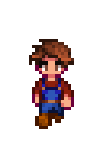
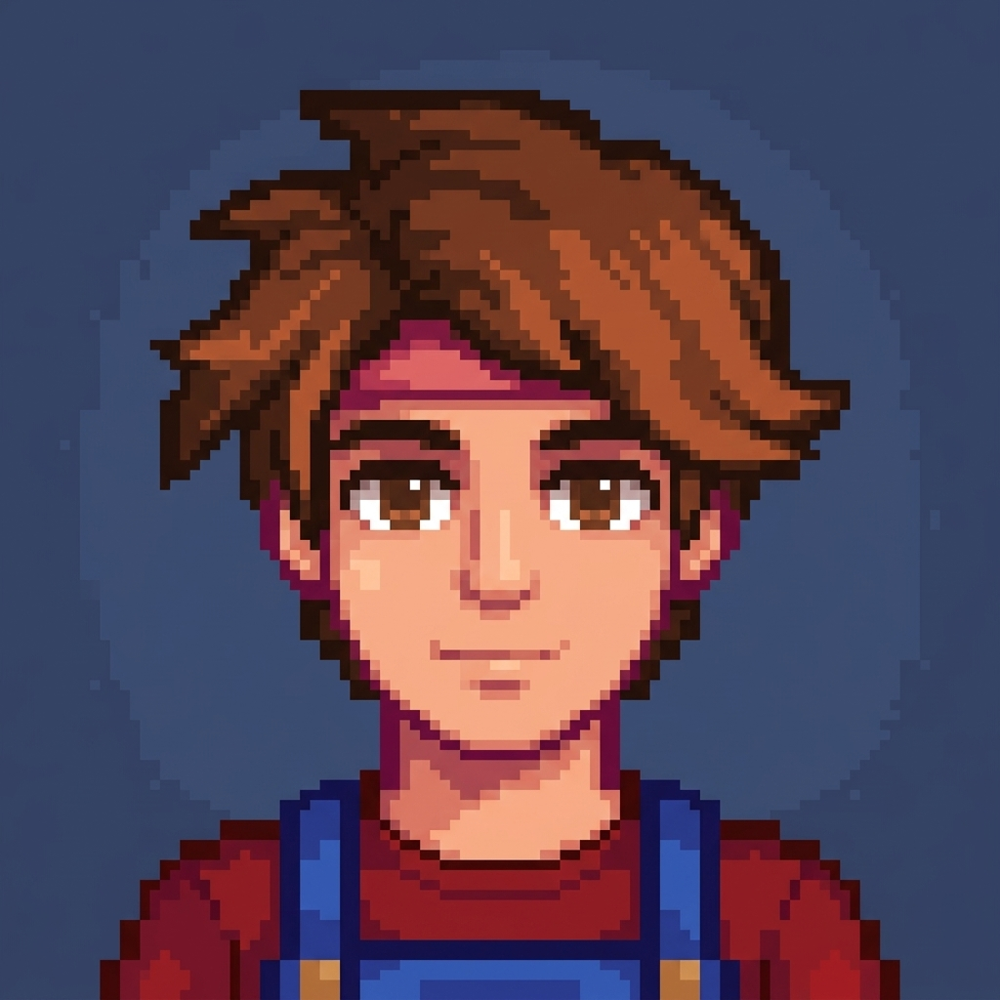
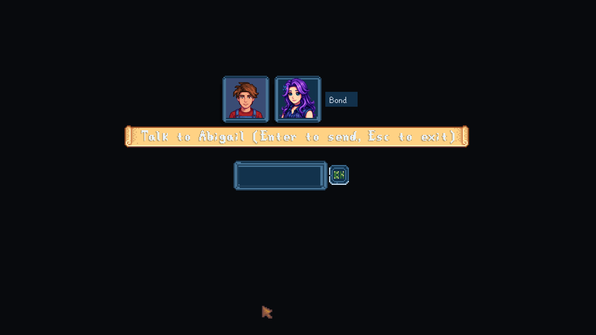
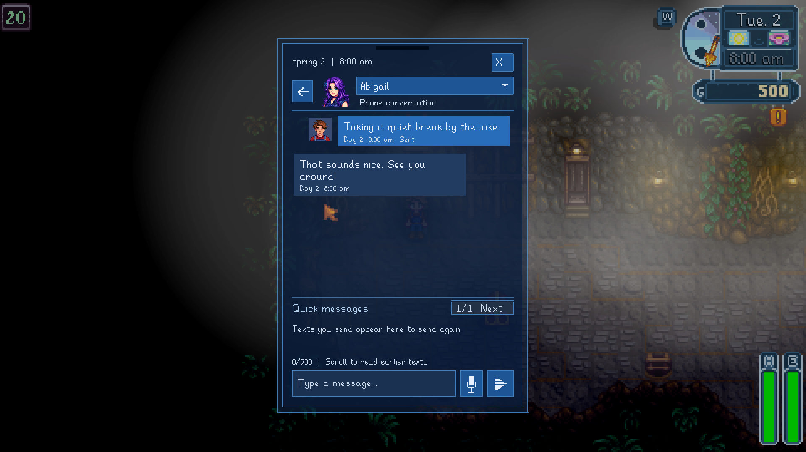

# Player portrait — real Gemini proof

September 6, 2026. Automatic player portraits are installed with SolaceWeather 0.3. The conversation window and native phone share the same cached portrait. Creation, overnight saving, restart reuse and the phone display have been checked in disposable native farms; the 11 real player-save files remained unchanged.

## Historical provider proof

The initial authorized image-generation request succeeded using `gemini-3.1-flash-image` and the documented Gemini `v1` generateContent endpoint. No model substitution or retry was used for this initial proof. The following reference and result document that earlier prototype, separate from the installed integration described below.

The reference was captured from the actual native FarmerRenderer in a disposable saved farm. It includes the farmer's composed body, hair and clothing without the game world or interface. A fake event farmer supplied the rendering state; the real farmer's position, facing, animation and appearance remained unchanged.

The returned 1024×1024 PNG visually retains the test farmer's brown hair, brown eyes, red shirt and blue overalls. It is a generated interpretation, not an exact pixel-for-pixel face reconstruction. The request returned HTTP 200 in about 8.5 seconds. PNG decoding, nonblank image checks and byte/dimension limits passed.

The image was saved under the numeric farm and player identities, including the native signed player ID. The cached file was read and hash-checked, then decoded and hash-checked again in a separate Node process without another provider request. Offline validation passed identity/token checks, invalid image rejection and fallback preservation. The prototype has a single-request lock to prevent accidental repeated paid calls.

Only the avatar image and a bounded portrait prompt were sent. Credentials, save contents, farm/player names, conversation history and relationship data were not included or logged.

## Automatic game integration

The service is now wired to confirmed native character creation. The corrected Release build automatically generated a matching 1024-square portrait for disposable farm 202609060717, displayed it beside the NPC in the real conversation input, saved through the native overnight flow, and reloaded the identical cached portrait in a fresh process. Reconfirming creation did not start another request. Cache image, metadata and attempt marker stayed byte-for-byte unchanged across restart. The 11 original player-save files remained unchanged.

The service accepts bounded PNG/JPEG input, normalizes its cache to PNG, keeps a native fallback and an explicit Retry button after failure, and never generates from drawing or ordinary outfit changes. Per-farm and signed player IDs separate caches. Source validation includes 177 core tests. The earlier farm's first attempt and explicit retry used an older Release build and retained the fallback; their provider failure reason was not recorded, so JPEG cannot be claimed as the confirmed cause. The successful final farm used the rebuilt Release DLL, without a retry.

SolaceWeather 0.3 is now installed in the normal game. The combined native run verified the phone uses the same cached portrait hash as conversation input, without another portrait-provider request. Cache reuse continued through three overnight saves and restart; all 11 real player-save files remained unchanged. The installed release has 205 passing core tests; native checks passed for phone behavior (23), number exchange (24), public chatter (14), and the cemetery outing (8, on an eligible Friday). These counts cover their named systems, not exhaustive portrait appearance matching.

Combined evidence is under `artifacts/new-game-persistence/phone-combined-20260906`, including `Profile/phone-portrait-proof.json`, `Profile/phone-portrait-proof.png`, `restart-proof.json`, `native-save-events.json` and `real-saves-preserved.json`. This service supports single-player local portraits; multiplayer sharing and exhaustive appearance matching have not been validated.

Runtime evidence: `artifacts/new-game-persistence/player-portrait-final-20260906/auto-ready.json`, `reuse-ready.json`, `native-save-events.json`, `restart-proof.json`, and `real-saves-preserved.json`.

Evidence: artifacts/player-modern/portrait-test/status.json, reference.json, prompt.txt, request.mjs, validation.test.mjs and the per-identity cache. [Google image-generation documentation](https://ai.google.dev/gemini-api/docs/generate-content/image-generation).
