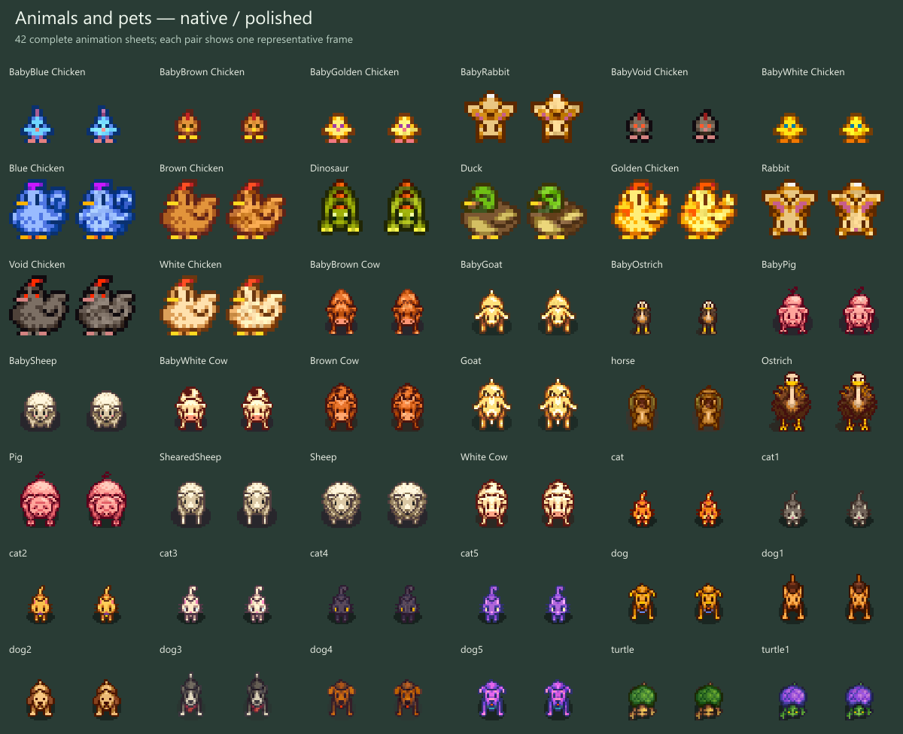

# Farm animals and pets — installed in 0.15.0

42 native sheets have been prepared and added to source: 27 livestock sheets, 14 pet sheets and the horse. This includes baby/adult and color variants, cats, dogs and turtles. Native dimensions, transparency, silhouettes and repeated animation frames are preserved.

The combined preparation check passes all 42 sheets and preserves all 547 previous artwork files. It records 151,058 changed material pixels. Four turtle debug cells remain exact; two dormant cat/dog sheets are included without inventing new selectable breeds. The technical Animals/Error texture is retained.

Installed September 6, 2026 with the utility-building batch and toolbar label improvements. All 309 native animal checks passed, including actual creature draws, source frames and breed routing. Isolated and normal launches verified the complete 606-texture, 610-file package. All earlier artwork is retained. Evidence: artifacts/npc-modern/evidence/isolated-0.15.0.json and installed-0.15.0.json.

Evidence: [preservation checks](../../artifacts/farm-animals/preservation-checks.json), [native inventory](../../artifacts/farm-animals/inventory.json). Final native captures are in artifacts/npc-modern/runtime-audits/0.15.0-20260906-162857-177/Mods/NpcArtAudit.

Player checks after installation: inspect adult/baby livestock, movement and sleeping, duck swimming, sheared sheep, horse riding and every available pet appearance. Confirm hats and water-bowl interactions still align.
