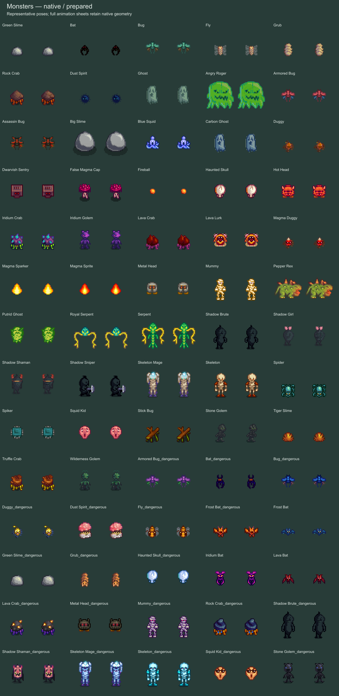

# Monsters and wildlife — installed 0.19

The authorized remake preserves native sprite sizes, animation layouts, outlines and gameplay behavior. Artwork preparation and the 688-entry registry integration are complete in source. The fresh coverage scan and final native audit passed, and version 0.19.0 is installed in the normal game. The final normal-startup check also passed with Solace 0.4.0 in the same process.

## Scope

Wildlife before/after sheets and exact scope are linked from the [wildlife artwork notes](../../artifacts/wildlife-modern/README.md).

The monster inventory contains 73 sheets: 47 base monsters, 23 variants, and three wildlife-named sheets prepared with the wildlife batch. Cat, Crow, Frog and Fireball have unconfirmed live native callers; their prepared artwork does not prove they appear during normal play. Actual ambient crow and frog sprites use the critter sheet.

Wildlife adds eight newly prepared whole sheets: critters, companions, perching birds, ambient bats, gem birds, the island sand creature, the sea monster and aquarium fish. The three monster-named wildlife sheets bring that batch to eleven whole-sheet outputs. The existing island parrot bank was already complete and remains unchanged. Emily's separate parrot animation adds two exact patches to the shared cursor sheet; all other cursor pixels and existing patches are preserved. Farm livestock and pets remain intact.

## Wildlife follow-up coverage check

A fresh native-source check found no additional ordinary wildlife sheet to remake. Birds, butterflies, crabs, crows, frogs, monkeys, opossums, owls, rabbits, seagulls, squirrels and woodpeckers use the completed critter sheet. Sebastian's two pet frog animations also load that sheet. Flying, hopping and hungry-frog companions use the completed companion sheet; perching birds use the completed bird sheet. Island parrots and Emily's parrot are covered separately as described above.

Fireflies draw a tinted rectangle and native light rather than a separate animal texture. Prismatic butterfly sparkles are an effect, not an omitted butterfly body. Parrot construction debris and swimming shadows are support artwork, not missing wildlife. The source search found a whale in Junimo Kart, which belongs to the separately tracked minigame scope. This check does not claim exhaustive coverage of every festival or special scene.

The ending's Summit code explicitly excludes Fireball, Cat, Crow and Frog before its generic monster texture load. Those mentions therefore do not establish live callers for the four previously unconfirmed sheets. No duplicate artwork generation, installation or game launch was needed for this follow-up.

## Artwork evidence

The base-monster preparation covers 47 sheets and reports 72,005 changed pixels, with 85 duplicate groups preserved after correcting the Haunted Skull frame contract to 16 × 16. All 23 variant sheets are prepared, with 28,938 changed pixels. Together with wildlife, the batch changes 162,206 pixels. Integration preserved all 638 prior PNG files. A separate written-PNG validator is available at `artifacts/monsters-modern/rootbase-independent-validation.mjs`; its output records the actual manifest size checked at each run rather than assuming the entire batch passed.

Wildlife's independent validation passes twelve outputs, including the shared-sheet patch: 61,263 changed pixels, zero alpha changes, zero hidden-color changes, zero outer-edge changes and zero RGB-difference violations. Emily's parrot patch changes no pixels outside its two authorized rectangles. Existing island parrots are preserved, not counted as a new generated sheet.

The artwork uses generated material detail inside native geometry. Protection masks preserve functional and identity pixels, and repeated native poses remain repeated where the monster contracts define duplicate groups. Neutral and colored tint material retains its RGB differences. These checks support sprite compatibility; they do not prove combat, every animation, all wildlife behavior, multiplayer or save persistence.

Native contracts, exact prompts, donors, before/after sheets and manifests are under `artifacts/monsters-modern` and `artifacts/wildlife-modern`. The monster overview uses vetted display crops for Angry Roger, Haunted Skull and Fireball so technical blocks or partial adjacent poses are not shown as representative artwork.

## Native verification and installation

Final runtime evidence is under `artifacts/npc-modern/runtime-audits/0.19.0-20260906-193051-183`, including `monsters-wildlife-checks.json` and `player-hd-production-checks.json` within the audit output. Earlier audit failures came from applying the wrong alpha baseline to already-remade parrots and selecting the legacy player-HD test. Correcting those test selections/contracts produced the final pass; no artwork change was required.

Normal installation retained backup `AbigailModern-20260906-193225`. The normal-startup evidence session is `artifacts/npc-modern/installed-audits/0.19.0-20260906-193232-198`; its final verification passed. Installed proof is recorded in `artifacts/npc-modern/evidence/installed-0.19.0.json` and `loader-installed-0.19.0.txt`. All 11 original save-file hashes remain unchanged. Art and audio configuration files are byte-identical to the backup, including MuteMusic=true.

The coordinator has integrated 81 new whole-sheet registrations and one shared-sheet update, bringing the registry from 607 to 688. The fresh `artifacts/asset-remake-scan-0.19` scan decoded all 999 native textures with zero errors: 634 registered native names, including every monster sheet, and 365 unregistered exact names. All 17 HD companions and twelve clothing catalog items still pass their separate checks. Historical scans remain unchanged. The final native audit passed all 249 monster/wildlife checks and 103 production player-HD checks. It covered all 82 unique whole-sheet routes, including the preserved island parrots, plus 14 actual monster drawing fixtures and three actual critter fixtures. Emily's cursor patch was checked separately. All 688 texture registrations and 721 package files passed verification, and the production player-HD checks also passed. This is selected native rendering coverage, not exhaustive combat, spawning, animation, multiplayer or save-behavior testing.
