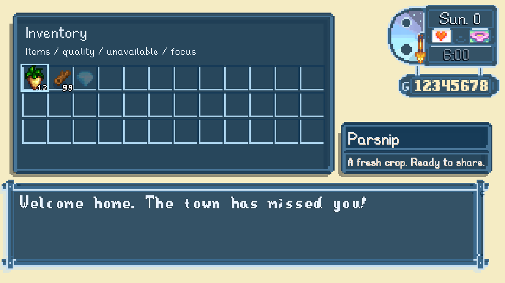

# Translucent blue UI — 0.13.0

Installed and verified on September 6, 2026. Shared menus, dialogue, letters, boards, interface symbols and Solace widgets now use translucent blue panels with readable light text. Native layout, fonts and controls remain intact.

Coverage: 87 sheets (30 base and 57 localized), with 474 reviewed shared UI regions. The complete artwork package contains 547 registered textures and 551 files. Existing item, crop, actor and world patches were preserved; localized glyphs and semantic dye colors remain intact. Panel transparency is intentional.

Validation: production Release build passed with no warnings or errors; audit build passed with four existing warnings. Forty text behavior checks, 28 UI checks, eight GPU captures and 23 visual-effects checks passed. Preservation checks verified 1,771,426 prior pixels; 172,909 contrast regression pixels passed. Isolated and fresh normal launches verified all 547 textures and 551 files. Music remained muted, with effects at 1 and ambience at 0.75. No farm was loaded or saved. Owned test processes were stopped.

Local evidence: artifacts/npc-modern/evidence/isolated-0.13.0.json and installed-0.13.0.json. Final captures: artifacts/npc-modern/runtime-audits/0.13.0-20260906-151257-031/Mods/NpcArtAudit. Previous installation backup: artifacts/mod-backups/AbigailModern-20260906-151347. Generated evidence and backups are intentionally excluded from Git.

Player checks remaining: try controller navigation, shops, crafting, full mod menus and NPC conversations during ordinary play. Captures cover representative native interfaces and scaled render targets, not every menu interaction or actual operating-system display scale.

To run the text checks from the repository root, build src/AbigailModern and src/SolaceWeather in Release, then run `dotnet run --project tests/AbigailModern.UiChecks -c Release`. A local Stardew Valley and SMAPI installation is required; set GameDir for another installation path.
