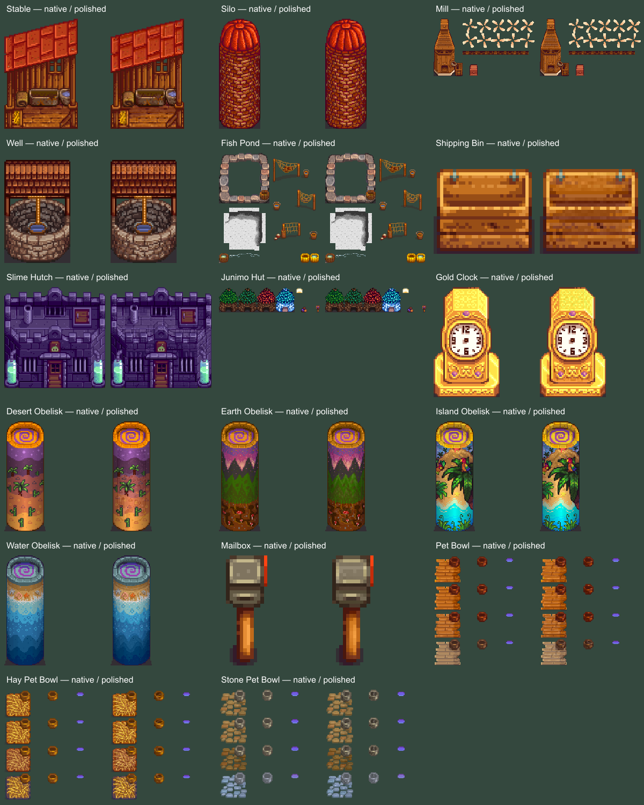

# Remaining farm structures — 0.15.0 installed and verified

All 17 remaining nontechnical Buildings textures are prepared in the established Polished Stardew style: Stable, Silo, Mill, Well, Fish Pond, Shipping Bin, Slime Hutch, Junimo Hut, Gold Clock, Desert/Earth/Island/Water Obelisks, Mailbox, Pet Bowl, Hay Pet Bowl and Stone Pet Bowl.

Installed September 6, 2026. The registry contains 606 textures, including the 42 animal/pet sheets. Earlier farmhouse/cabin/barn/coop/greenhouse/shed artwork is retained.

Independent combined checks pass all 17 sheets: 34,888 material pixels changed, with zero changes to dimensions, transparency, hidden pixels, outer silhouettes or RGB channel differences. All 589 previous artwork files retain their hashes. Equal RGB shading adjustments preserve original color relationships and paint compatibility.

Native functional artwork is preserved, including mill animation banks, fish-pond water bed/bobber, Junimo door/overlays, clock face, obelisk spirals and pet-bowl water overlays. Native seasonal appearances are retained rather than adding unsupported states. Generated donor layouts are never installed directly; bounded surface shading is transferred into native geometry.

Evidence: [preservation checks](../../artifacts/utility-buildings-modern/preservation-checks.json). Exact generation prompts, copied donors, preparation scripts, independent checks and before/after previews are retained in the utility, magic and small subfolders of artifacts/utility-buildings-modern.

Validation passed: 313 native utility-building checks, 309 animal checks, 321 toolbar checks and 23 effects checks. Isolated and normal startup both verified 606/606 textures and 610 file hashes. Native captures include seasonal selections, wet bowls, pond water/net variants, shipping lid, Junimo overlays, clock hands and paint. Peak isolated process memory was 3,355,136,000 bytes. Music remains at zero, effects at 1 and ambience at 0.75. All owned test processes were stopped.

The initial audit had two test-only problems: inconsistent partial-alpha decoding for protected PNG pixels and missing mailbox coverage through its Farmhouse draw layer. Correcting the test baseline and native route resolved both without changing artwork. Final evidence: artifacts/npc-modern/evidence/isolated-0.15.0.json and installed-0.15.0.json. Previous installation backup: artifacts/mod-backups/AbigailModern-20260906-163004.

Player checks: painting the stable, using the mill/shipping bin, inspecting stocked fish ponds and wet pet bowls, and viewing Junimo huts across seasons. Detached native rendering does not simulate every gameplay interaction or long-term production cycle.
