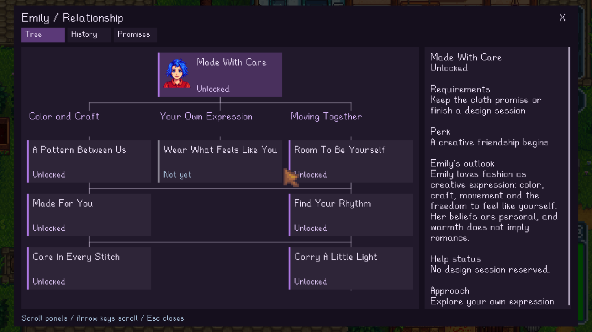
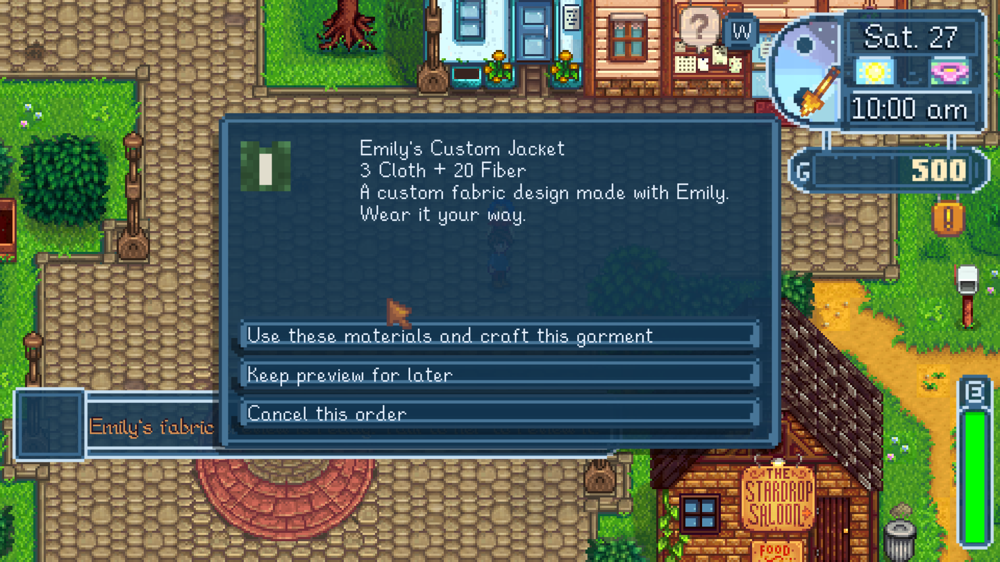

# Emily creative friendship and custom tailoring

Implementation baseline: `c492441` (verified combined Solace 0.4 source). Single-player only. Existing saves/configuration are not replaced.

## Behavior

Emily has a distinct warm, energetic, fashion-centered voice, with sewing, dance, dreams, meditation, crystals and community interests. Current native facts override authored interpretation. Unseen heart events stay private; personal beliefs are not verified supernatural healing. Missing observation does not prove the player lied. Five structured reactions use existing portrait cells, with neutral fallbacks. Phone and public chatter remain brief.

An explicitly accepted Cloth promise requires actual eligible Cloth delivery. An accepted Town design session starts at 11–11:30 am and finishes by noon, through three ten-minute choices and a rendered palette. It records an idea, not an item. Later movement breaks require a free, stationary Emily, actual rendered native exercise frames and two ten-minute steps. The first break awards no energy; later breaks can restore 30 energy once per seven days. The eight-node tree uses actual promise/activity/craft evidence. Higher-node fixtures used in automated audits are not proof of natural progression.

Custom tailoring is unlocked after the cloth promise, two design sessions and three conversation days. The player describes fabric, explicitly requests a Gemini preview, then separately approves crafting. Each production order requests a new image; there is no automatic request on loading, equipping or failure. One pending order, three explicit attempts per order, 24 saved orders per farmer, bounded payloads. Cancelled attempts currently count toward that order limit.

Generated fabric shading and average color are fitted to a fixed native jacket/trousers cut. This is not arbitrary generated garment geometry. Shirt templates are 256×32; trousers are 192×688. Native masks/sleeve markers remain authored. The tiny wearable pattern is much simpler than the source image. Each item has a permanent order ID, saved PNG/hash and dyeable native clothing record. The save contains the artwork; no external generated-art cache is required. Damaged artwork keeps the item ID with a fixed fallback and no provider request.

Reviewable balance: 3 Cloth + 20 Fiber per garment; one garment every three days. After two crafted garments on separate days and an actual movement break, a Mend Jacket also needs 1 Jade and restores 1 health per active minute, capped at 20/day; Renew Trousers also need 1 Aquamarine and restore 2 energy per minute, capped at 40/day. Only worn, owned, fulfilled items count. No menu/pause/offline/dead recovery, no stacking, ten seconds after damage, no cap consumption at full health/energy. Unequipping resets partial progress. These are deterministic game effects, not Gemini-created statistics or supernatural claims.

## Evidence

- All 11 tracked real-save files retain their original hashes.
- 241 Core tests pass; Release mod and native harness build with zero warnings/errors.
- Live Gemini fabric probe: one successful reference-image request after the earlier separate prototype returned no image. HTTP 200, actual 1024×1024 JPEG, 594,286 bytes; 1,786 total tokens including 1,120 image-output tokens. SHA256 `102EF469570D10F7D1DBD713A6BA3D7AE01DCF9EC8B3DE83638960A394804FB3`.
- The actual new donor was passed through the production main-thread converter and order completion. Native shirt and pants records/textures match saved PNG hashes. The donor was reused for deterministic test orders only, without additional provider calls. Production provider parsing also has a one-call failure test; the full UI-to-provider request was not repeated in the game audit.
- Actual Cloth handover removed exactly one item. An actual accepted native design session finished at 11:30, recorded its choices and restored movement. Actual native exercise frames and a completed twenty-minute movement break were observed. Three live in-person conversations covered fashion/shared history, unseen player bird rescue/crystal beliefs, and an attempted free magical outfit instruction. No garment or reward was created by dialogue.
- Plain and recovery garments used the production crafting path: protected materials rejected, exact costs consumed, duplicate craft rejected, shared cooldown enforced. The harness supplies materials and prerequisite milestones; it does not simulate earning every early milestone naturally.
- Fresh-process copied-save load: stable IDs, native texture pixel hashes, inventory/equipment and non-default dyes retained. `SaveParsed` preceded `SaveGame.loadDataToFarmer`; both garment rows and registry texture routes existed before native farmer restoration. Only save contents and harness ownership metadata were copied; no tailoring cache exists.
- Seven native recovery checks pass: no early gain, equipped gain, damage delay, menu exclusion, unequipped exclusion, daily caps, serialized caps. Time is accelerated through production recovery in this test; original equipment/health/energy/caps are restored afterward.
- Five native loader checks pass: alternate farmer has no orders, prior IDs disappear, warmed registry misses are cleared on republishing, corrupt image retains IDs, and corruption starts no provider call. Alternate-farmer/corruption checks use in-memory fixtures through the production loader; they are not a second full native farm load.
- Shared regression checks pass: phone 23/23, chatter 14/14, cemetery 8/8, fashion 3/3. The cemetery harness now selects an actually free native evening instead of assuming every test date is available.

Evidence directories (disposable SvaAudit only):
`C:/Users/david/SDV/artifacts/new-game-persistence/phone-emily-20260906`
`C:/Users/david/SDV/artifacts/new-game-persistence/phone-emily-copy-20260906`
Live donor/status: this worktree's `artifacts/emily-tailoring/`.

## Player checks still needed

Play the progression without prerequisite fixtures; judge pacing and balance. Try movement during ordinary free time at Emily's house. Review several different generated patterns on both body variants and all movement/tool animations; the audit captures four idle directions and native icons, not every frame combination. Check preview/input accessibility at smaller UI scales and controller use. Try save copying through the player's normal backup workflow. Multiplayer, arbitrary garment silhouettes and custom HD companions are not implemented.

## Combined integration verification

The combined Solace 0.5 source with NPC Modern 0.22 passed 133 native checks across isolated process groups on September 6, 2026: profile reactions and Penny home context 37, tailoring recovery 7, tailoring isolation/restored artwork 9, phone 23, exchange 24, chatter 14, cemetery 8, fashion 3, and garment IDs/pixel hashes 8. Fresh copied-save load retained all four orders, equipped IDs and non-default dyes, with SaveParsed preceding native farmer restoration. No provider request was issued.

The corruption fixture exposed a stale fallback texture during artwork restoration; publication now invalidates garment textures after repopulating their images. Four restored pixel hashes pass. Earlier fixture failures and corrected ordering are retained in the evidence. Four standing Town directions were visually reviewed with the HD player body; no obvious garment clipping or sleeve/body seam was seen. This does not cover every tool or movement frame. Evidence: `artifacts/emily-integration/runtime-summary.json`; images: `artifacts/new-game-persistence/phone-emily-combined-20260906-205143/restored-facing-0.png` through `restored-facing-3.png`.
