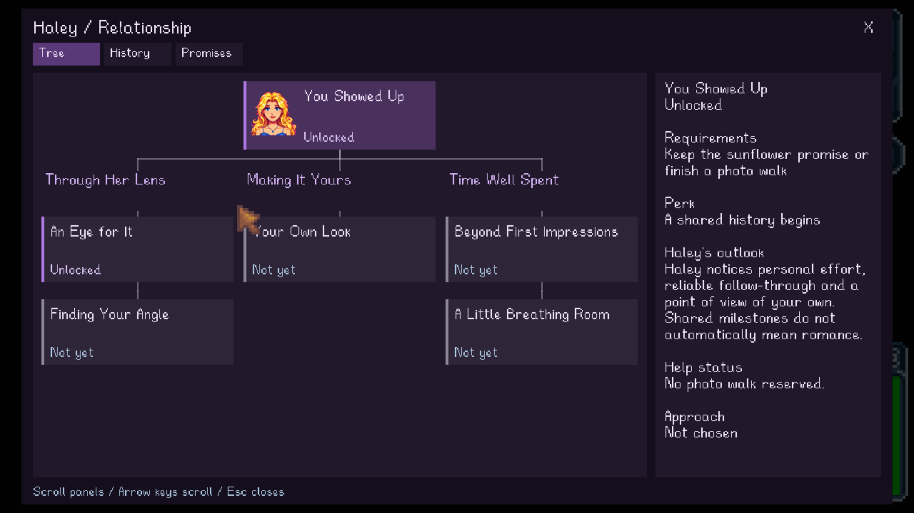
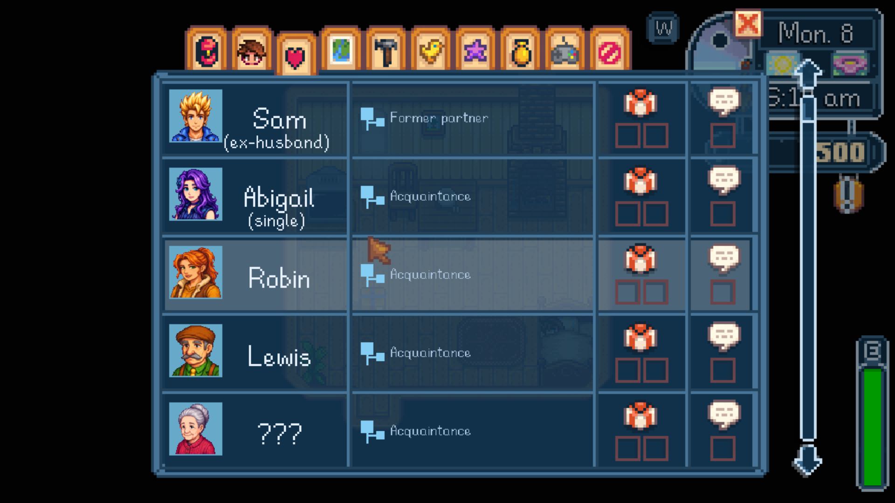
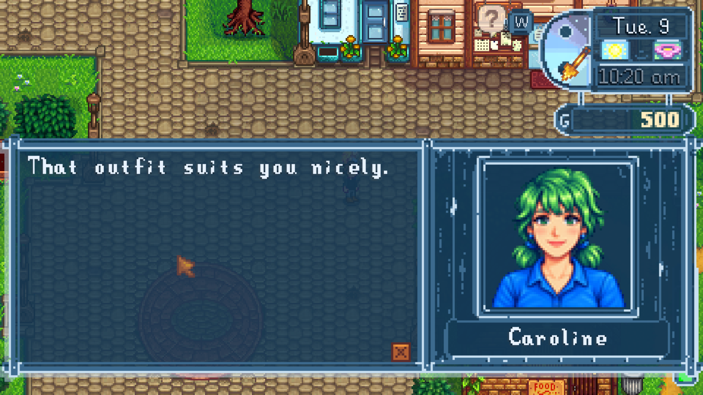

# Haley, outfit observations, and Social portraits

Validated on September 6, 2026 in the isolated `codex/haley-ai` worktree, after combined baseline `5f6b685`, with Stardew Valley 1.6.15, SMAPI 4.5.2 and NPC Modern 0.18.0. These changes were not installed into the normal game by this task. The integration owner retains release/version/package ownership.

## What changed

Haley uses the shared personal-memory system with her own voice, a sunflower promise, afternoon photo walks and six evidence-based milestones. Promises and invitations require explicit acceptance. Delivery removes one eligible sunflower; protected items are excluded. Three actual photo steps and the rendered shutter complete a session. Interruption creates no false completion. Repeat sessions open after three days. Style advice and a creative preference are explicit choices; the quiet break requires availability and recovers up to 30 energy after 20 native minutes, once per seven days.

Fashion observations read equipped native clothing and dye information. The shared NPC Modern catalog provides hidden values and style tags; unknown pieces are neutral. Twelve full AI candidates and 27 additional authored native NPC profiles have individual tastes. Phone conversations see only each NPC's previously observed outfit. Optional comments have change/cooldown limits and never change friendship, romance, prices or combat statistics. Native comments preserve the original line and use the native continuation flag; cooldown is consumed only after the added line is fully displayed.

The Social list replaces heart drawings with relationship names and small character sprites with existing portrait headshots. Native friendship data, names, gift/talk indicators and click targets remain intact. Actual agreed dating shows Girlfriend/Boyfriend; tree progress alone cannot start dating. Unknown/modded NPCs have neutral fashion and native friendship display fallbacks. Missing portraits retain the native avatar.

## Evidence

- 222/222 core tests passed. Final Release game/harness build passed with no warnings or errors.
- 24 new native assertions passed: wrong NPC/stale/declined/protected-item promise actions; native outfit and phone observation boundaries; original dialogue preservation/unread cooldown; sleeping/full-energy/repeated rest guards; consent/early/late/cancelled photo walks; Social journal click/scroll return/unchanged friendship; exact one-item delivery; and displayed native fashion cooldown.
- Existing native regressions passed: phone 23, public town chatter 14, cemetery 8.
- One actual accepted sunflower delivery and one complete three-step photo walk ran in the disposable farm. Movement was restored, actual framing/style were recorded, and the first two milestones unlocked. Native Saving/Saved events were observed, then a full process restart retained the promise, photo session, milestones and outfit observations. Later actual conversation days unlocked the personal milestone.
- Rest availability/cooldown tests used temporary milestone fixtures. They are not evidence of three organically completed photo walks. The native 20-minute rest did execute, and the disposable memory records that test interaction.
- Five bounded live Gemini requests covered disagreement/low friendship, observed outing recall, updated preferences, a dated personal plan, higher friendship and a replacement invitation. The fourth sample used the right calendar date but the wrong relative word; explicit CurrentDate/Timing grounding fixed the fifth sample's same-day invitation. The final wording also avoids describing the outing as UI choices. These samples do not guarantee every generated reply.
- A separate existing disposable control farm passed six isolation checks: service ready, no promise, no outing, no milestones, no outfit observations and no Haley exchanges. No control progress was saved.
- All 11 tracked files in the user's real save directory retained their pre-test SHA-256 hashes. No normal configuration, saved game or artwork installation was overwritten. Test portrait generation was disabled.
- The final control-session log had no Solace/NPC Modern warnings or errors. The expected hidden-terminal warning and Steam-achievements-unavailable message were present.

Raw local evidence is under `C:/Users/david/SDV/artifacts/new-game-persistence/phone-20260906/`: `haley-evidence/`, `haley-completed-state.json`, `haley-after-restart.json`, `haley-final-state.json`, `haley-gemini-samples.json`, `native-fashion-displayed.json`, `user-saves-after-haley.json`, and `haley-final-control-smapi.log`. Control results are in the adjacent `phone-20260906-control/haley-isolation.json`. The audit events file resets at each process start; before/after snapshots and observed Saving/Saved tool output support the restart check.

Actual game captures are checked in:

## Integration and player checks

Apply only the feature commit after `5f6b685` to the matching combined source. Preserve current config and save data; `EnableFashionComments` defaults to true when absent. NPC Modern 0.18 supplies its catalog as a JSON string at `David.AbigailModern/FashionCatalog`. Older packs remain usable with neutral unknown-clothing observations. The test harness must not be included in the normal installation.

After integration, confirm the normal game loads the release, Haley's tree opens, the Social portraits/stages render, and existing phone/Abigail features remain available. Player checks remain for long-term voice/reminder frequency, natural repeat sessions across different seasons/schedules, physical controller navigation, other languages and UI scales. The tested display was 1920x1080 with the existing scaled UI; no claim is made about every resolution or modded NPC.

## Combined 0.4.0 release preparation — September 6, 2026

The 38 feature files from commit `0bc391e289838bb85299bd9d001850fc2e3d12da` were integrated against parent `5f6b685` using per-file three-way merges. Current workspace changes were preserved. PersonalMemoryStore and RelationshipTreeMenu required line-ending normalization before clean merges; no unresolved conflicts remain. The integration report and original merge inputs are retained locally under `artifacts/haley-integration/`.

The combined source passed all 222 Core tests. Release builds of SolaceWeather and the native game test harness passed with zero warnings and errors. These are integration checks, separate from the earlier isolated runtime evidence above. Solace Weather 0.4.0 was installed and its normal title-screen startup verified alongside NPC Modern 0.18. The recorded normal log contains no Solace or NPC Modern errors, and all 607 registered artwork checks passed. The owned test process was then stopped without loading a farm. This title check does not replace the earlier disposable-farm tests or the remaining player checks. The installer backed up the previous mod and verified the configuration plus all 11 original save files were unchanged during installation. Normal startup subsequently added the new EnableFashionComments default to configuration; all pre-existing settings retained their values. The final check compares all 11 save hashes against the original baseline. Evidence: `artifacts/haley-integration/installed-0.4.0.json` and `normal-0.4.0-smapi.log`. The release package includes production files and documentation only; no test harness, configuration or user save data is included.
